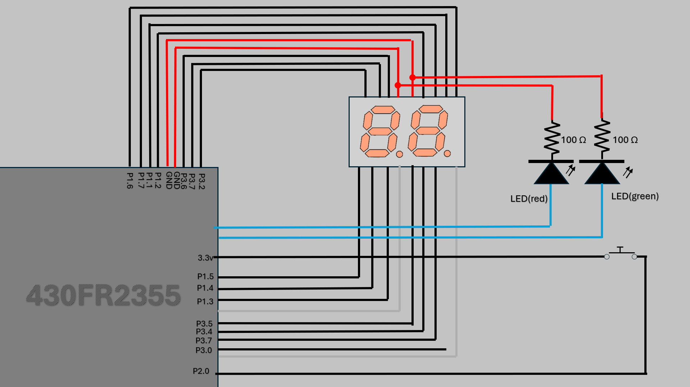

# CrapsGame
## Layout

## How to play Craps?
- Round 1:
    - If you roll a 7 or 11, you win!
    - If you roll a 2, 3, or 12, you lose.
    - Rolling a 4, 5, 6, 8, 9, or 10 sets that number as your target.

- After Round 1:
    - Rolling the target number again will win the game.
    - Rolling a 7 before hitting the target number will result in a loss.